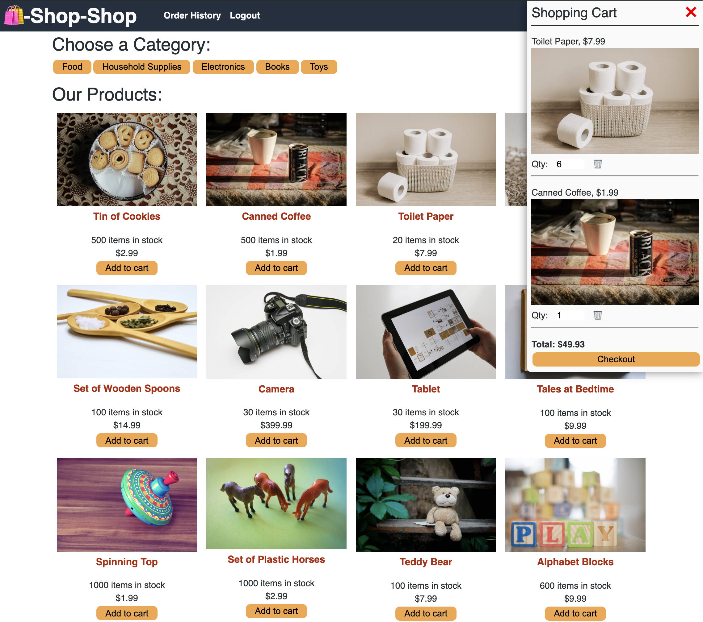

# Mern Shop Redux

<div style="position: absolute; top: 22px; right: 50px">


</div>

## Description
Mern Shop Redux is an over engineered full stack web application for online shopping!

### [Go To Deployed Application](https://mern-shop-redux.herokuapp.com/)


Technologies:
  - MongoDB - (data base)
  - Express.js - (the server)
  - React - (responsive front end SPA)
  - Node.js - (running js on the server)
  - Redux - (global state management)
  - GraphQL/ Apollo - (querying from and mutating data in MongoDB)
  - indexedDB - (Storing data on the client side)
  - Stripe API - (payment processing)
  - JSON Web Tokens - (encoding logged in user details)
  - Bcrypt - (encrypting user passwords)

## Table of Contents
  - [Description](#description)
  - [Usage](#usage)
  - [Tests](#tests)
  - [Questions](#questions)
  - [License](#license)


## Usage
Go to [Mern Shop Redux](https://mern-shop-redux.herokuapp.com/) and shop till you drop! The stripe integration uses a test api key so you won't actually be charged if you make a purchase.

## Tests
Navigate to the client directory and run the command ```npm test``` to test the reducer function passed into to the apps redux store. The tests check to make sure that both the initial state is unaltered and the selected action returns a new state as expected on dispatch.

## Questions
Feel free to reach out with any question you have about Mern Shop Redux!

### Contact information:
- GitHub: [matt-gross-27](https://www.github.com/matt-gross-27)
- Email: [mbgross111@gmail.com](mailto:mbgross111@gmail.com)

## License
- MIT
